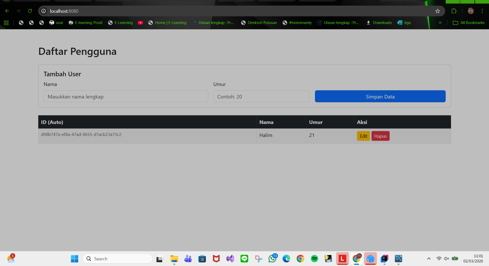
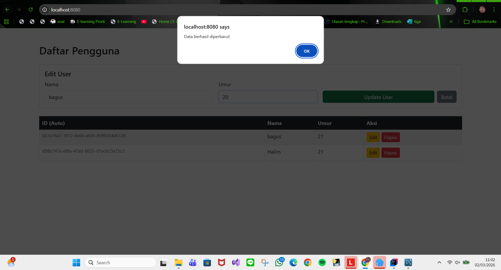
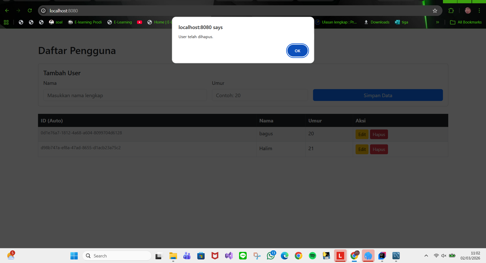

# User API Specification

## Create User
Endpoint : POST /api/users

Request Body :

```json
{
  "nama" : "Halim",
  "usia" : 21
}
```

Response Body (success) :

```json
{
  "data": {
    "id" : "random string",
    "nama": "Halim",
    "usia": 21
  }
}
```

Response Body (failed) :

```json
{
  "error": "Invalid input data"
}
```

## Update User
Endpoint : PUT /api/users/{id}

Request Body :

```json
{
  "nama" : "Halim Update",
  "usia" : 21
}
```

Response Body (success) :

```json
{
  "data": {
    "id" : "random string",
    "nama": "Halim Update",
    "usia": 21
  }
}
```

Response Body (failed) :

```json
{
  "error": "User not found"
}
```

## Get User
Endpoint : GET /api/users

Response Body (success) :

```json
{
  "data": {
    "id" : "random string",
    "nama": "Halim",
    "usia": 21
  }
}
```

Response Body (failed) :

```json
{
  "error": "User not found"
}
```

## Delete User
Endpoint : DELETE /api/users/{id}

Response Body (success) :

```json
{
  "message": "User deleted successfully"
}
```

Response Body (failed) :

```json
{
  "error": "User not found"
}
```

Screenshot



